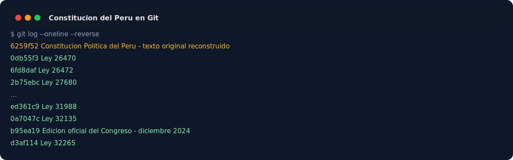
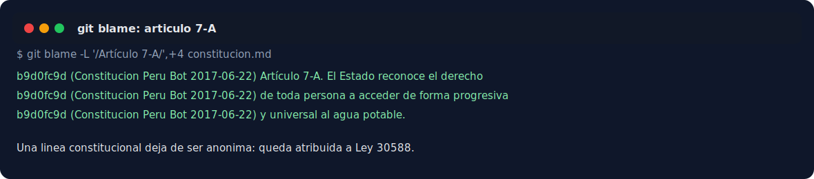
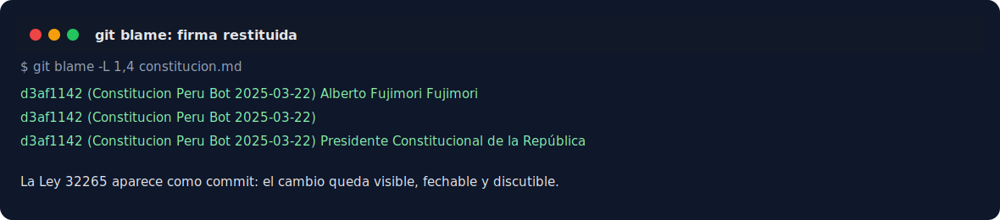

# Constitucion Politica del Peru como historial de Git

La Constitucion Politica del Peru ha sido modificada muchas veces desde 1993. Esas reformas normalmente aparecen como leyes, notas editoriales y textos actualizados en PDF.

Este repositorio intenta responder una pregunta simple: como se ve la Constitucion vigente si tratamos cada reforma constitucional como un commit?

La meta es que `git blame constitucion.md` muestre que ley introdujo o modifico cada linea.

> English version below.

## Demo rapida







Ver el historial publico con blame:

```sh
git clone --branch history https://github.com/Duvet05/Constitucion-Politica-del-Peru.git
cd Constitucion-Politica-del-Peru
git blame constitucion.md
```

Reconstruir el historial en un repo nuevo:

```sh
./scripts/build_history.py reformas.csv build/constitucion-peru-history
cd build/constitucion-peru-history
git log --oneline
git blame constitucion.md
```

La opcion `-w` ayuda a ignorar cambios de espacios cuando hubo normalizacion de formato:

```sh
git blame -w constitucion.md
```

## Estado

MVP auditable. Incluye:

- fuentes oficiales conocidas;
- scripts para descargar y normalizar texto;
- un inventario completo de reformas constitucionales;
- un manifest editable para reconstruir commits historicos;
- snapshots reconstruidos por reforma individual desde 1993 hasta 2025, incluyendo Ley 32265;
- una rama publica `history` con el historial Git reconstruido para inspeccionar `git blame`;
- una herramienta para reconstruir un repo historico desde snapshots.

La fuente oficial vigente usada como referencia principal es la edicion del Congreso de la Republica de diciembre de 2024, actualizada con la Ley 32265 de 2025. El texto conserva anotaciones editoriales cuando aclaran reformas, vigencia diferida, derogaciones o sentencias relevantes, porque el objetivo es publicar una Constitucion vigente y anotada.

Limitaciones conocidas:

- El texto original de 1993 esta reconstruido desde el checkpoint oficial de 2013, leyes oficiales pre-2013 y fuentes anotadas de contraste; no debe leerse como una transcripcion directa desde un OCR oficial perfecto de 1993.
- La Ley 31988, por su tamano y vigencia diferida, fue revisada para separar cambios sustantivos de normalizaciones editoriales evidentes; aun asi, algunos `blame` puntuales pueden requerir revision fina.

## Fuentes oficiales

- Constitucion vigente, pagina del Congreso: `https://www.congreso.gob.pe/datos-generales/constitucion-del-peru-y-reglamento/`
- PDF oficial, edicion diciembre 2024: `https://www3.congreso.gob.pe/Docs/files/constitucion/constitucion-12-2024.pdf`
- Biblioteca del Congreso, constituciones historicas: `https://www.congreso.gob.pe/biblioteca/constituciones_peru/`
- Texto HTML historico de 1993, si vuelve a estar disponible: `https://www.congreso.gob.pe/Docs/sites/webs/quipu/constitu/1993.htm`

## Estructura

```text
sources/              fuentes descargadas, no editadas
snapshots/            textos normalizados por fecha
reformas.csv          manifest de reformas y snapshots
metadata/             inventario historico y fuentes
constitucion.md       texto vigente que queda versionado por Git
scripts/              utilidades de descarga, normalizacion e historial
```

## Uso

Descargar fuentes:

```sh
./scripts/fetch_sources.sh
```

Normalizar un HTML oficial:

```sh
./scripts/html_to_text.py sources/archivo-oficial.html snapshots/YYYY-MM-DD.md
```

Extraer un snapshot desde el PDF oficial del Congreso:

```sh
./scripts/pdf_to_snapshot.py sources/constitucion-12-2024.pdf snapshots/2024-12-11.md
./scripts/canonicalize_snapshot.py snapshots/2024-12-11.md snapshots/2024-12-11.md
```

Validar que el snapshot contenga los articulos esperados:

```sh
./scripts/validate_snapshot.py snapshots/2024-12-11.md
./scripts/validate_snapshot.py snapshots/2024-12-11.md --current
```

Auditar detalles de extraccion del PDF:

```sh
./scripts/audit_snapshot.py constitucion.md --current
```

## Como completar el proyecto

1. Usa `metadata/reformas-constitucionales.csv` como checklist de reformas.
2. Coloca en `snapshots/` un archivo por cada reforma constitucional relevante.
3. Registra cada snapshot listo para reconstruccion en `reformas.csv` con fecha, norma, fuente y descripcion.
4. Ejecuta `scripts/build_history.py` para crear un repo historico limpio.
5. Revisa `git diff` entre commits para detectar errores de OCR, saltos de linea o notas editoriales.

## Criterio editorial

- Mantener la Constitucion vigente y anotada en `constitucion.md`.
- Conservar notas editoriales del Congreso cuando aclaran reformas, vigencia o textos futuros.
- Usar fechas de publicacion/promulgacion de la norma reformadora.
- No mezclar cambios de formato con reformas de contenido si se quiere un `blame` util.
- Corregir extracciones PDF solo en commits separados y auditables.

## Aviso

Este repositorio no es una fuente oficial. Usa fuentes oficiales del Congreso de la Republica y otros archivos legislativos para reconstruir un historial auditable.

---

# Peru Constitution as Git History

Peru's 1993 Constitution has been amended many times. Those amendments usually appear as reform laws, editorial notes, and updated official PDFs.

This repository asks a simple question: what would the current Constitution look like if each constitutional reform were treated as a Git commit?

The goal is for `git blame constitucion.md` to show which law introduced or modified each line.

## Quick Demo


View the public blame history:

```sh
git clone --branch history https://github.com/Duvet05/Constitucion-Politica-del-Peru.git
cd Constitucion-Politica-del-Peru
git blame constitucion.md
```

Rebuild the historical repository:

```sh
./scripts/build_history.py reformas.csv build/constitucion-peru-history
cd build/constitucion-peru-history
git log --oneline
git blame constitucion.md
```

Use `-w` to ignore whitespace-only normalization:

```sh
git blame -w constitucion.md
```

## Status

Auditable MVP. It currently includes:

- known official sources;
- scripts to download and normalize text;
- a full inventory of constitutional reforms;
- an editable manifest for rebuilding historical commits;
- individually reconstructed reform snapshots from 1993 through 2025, including Law 32265;
- a public `history` branch with the reconstructed Git history for `git blame`;
- a tool to rebuild a clean historical Git repository from snapshots.

The current official reference text comes mainly from the Congress of the Republic's December 2024 edition, updated with Law 32265 of 2025. The text keeps editorial notes when they clarify amendments, future effect, repeals, or relevant rulings because the goal is to publish a current, annotated Constitution with an auditable history.

Known limitations:

- The original 1993 text is reconstructed from the official 2013 checkpoint, pre-2013 official laws, and annotated comparison sources; it should not be read as a direct transcription from a perfect official 1993 OCR.
- Law 31988, because of its size and deferred effect, was reviewed to separate substantive changes from obvious editorial normalizations; some specific `blame` output may still need fine review.

## Official Sources

- Current Constitution, Congress page: `https://www.congreso.gob.pe/datos-generales/constitucion-del-peru-y-reglamento/`
- Official PDF, December 2024 edition: `https://www3.congreso.gob.pe/Docs/files/constitucion/constitucion-12-2024.pdf`
- Congress Library, historical constitutions: `https://www.congreso.gob.pe/biblioteca/constituciones_peru/`
- Historical 1993 HTML text, if available again: `https://www.congreso.gob.pe/Docs/sites/webs/quipu/constitu/1993.htm`

## Repository Layout

```text
sources/              downloaded sources, left unedited
snapshots/            normalized texts by date
reformas.csv          reform and snapshot manifest
metadata/             historical inventory and sources
constitucion.md       current text tracked by Git
scripts/              download, normalization, and history tools
```

## Usage

Download sources:

```sh
./scripts/fetch_sources.sh
```

Normalize an official HTML file:

```sh
./scripts/html_to_text.py sources/official-file.html snapshots/YYYY-MM-DD.md
```

Extract a snapshot from the official Congress PDF:

```sh
./scripts/pdf_to_snapshot.py sources/constitucion-12-2024.pdf snapshots/2024-12-11.md
./scripts/canonicalize_snapshot.py snapshots/2024-12-11.md snapshots/2024-12-11.md
```

Validate that a snapshot contains the expected articles:

```sh
./scripts/validate_snapshot.py snapshots/2024-12-11.md
./scripts/validate_snapshot.py snapshots/2024-12-11.md --current
```

Audit PDF extraction details:

```sh
./scripts/audit_snapshot.py constitucion.md --current
```

## How to Help

1. Use `metadata/reformas-constitucionales.csv` as the reform checklist.
2. Add one file under `snapshots/` for each relevant constitutional reform.
3. Register each ready snapshot in `reformas.csv` with date, law, source, and description.
4. Run `scripts/build_history.py` to create a clean historical repository.
5. Review `git diff` between commits to catch OCR errors, line breaks, or editorial notes.

## Editorial Policy

- Keep the current annotated Constitution in `constitucion.md`.
- Preserve Congress editorial notes when they clarify amendments, repeals, future effect, or relevant rulings.
- Use publication or promulgation dates from the reforming law.
- Do not mix formatting changes with substantive constitutional reforms if `git blame` should remain useful.
- Keep PDF extraction fixes in separate, auditable commits.

## Disclaimer

This repository is not an official source. It uses official sources from Congress and other legislative archives to reconstruct an auditable history.
